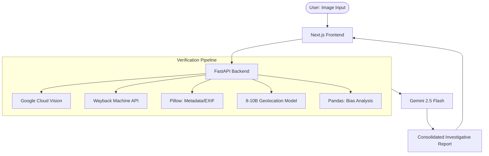

Aletheia (Greek for "truth") refers to the act of bringing something out of hiding. In today’s digital landscape, misinformation often proves as viral as any other commodity. While images were once the gold standard for verifying news, they have increasingly become the primary tools for deception. Today, it has become commonplace for news outlets, influencers, and commentators to use images as "definitive proof" for claims without providing any verification of their origins or context.

This web application aims to empower the everyday user by automating the complex process of image forensics. By simply uploading an image, users receive a comprehensive research report that would otherwise be prohibitively time-consuming to compile. I believe this tool can play a critical role in curbing the spread of hysteria and misinformation, and I look forward to its continued development.

 **Technology used:** built with NextJs, TailwindCSS and Typescript on the frontend. Connected via fastapi and uvicorn to the backend, which is built using python as well as several libraies and third party API's:
  SERP - google reverse image search as the main reverse image engine - currently working on moving over to cloudvision, due to lack of quality and consitent results with SERP API in testing. Used to find sources of similar images.
  Wayback machine - used to find the earliest archived date for a site, to try and find the earliest date for the image.
  AI OR NOT - A third party tool which is/was used to be able to distinguish between AI generated images, deepfakes and normally produced ones.
  gemini 2.5 flash - used to generate a summarize report
  PILLOW - for metadata extraction such as model, make, coordinates, ISO and other metrics useful in determining origin of images.(Important note, this was good for a start however exif data being present in all images is a            naive assumption as in some cases it is not available, and in some it is even altered.
  Pandas - cross checking image sources with a research grade bias dataset.
  Docker - To containerize the application.

NOTE: Currently the AI or NOT is purposefully ignored in the pipeline while considering alternative and conducting testing.

Workflow - User inputs images, they recieve the following:
Number of matches found related to the image, the bias split of a pie chart shedding some light on the bias of the sources using the image, the earliest date found via archives or other means, a source list, a metadata extaction summary, geolocation via exif coordinates (Shifting slowly to a 8 - 10B locally produced model for geolocation of images) a breakdown of the likelihood of the images being AI genereted or not.

